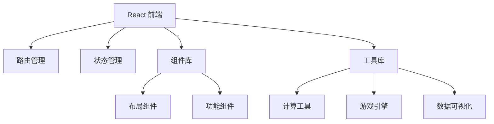

# 多功能超级平台 技术架构

## 1. Architecture Design



## 2. Technology Description
- **Frontend**: React@18 + TypeScript + Vite
- **CSS**: Tailwind CSS@3 + 自定义渐变动画
- **路由**: React Router DOM
- **状态管理**: Zustand
- **图标**: Lucide React
- **图表**: ECharts for React
- **初始化工具**: vite-init

## 3. Route Definitions
| Route | Purpose |
|-------|---------|
| / | 首页，模式导航入口 |
| /tools | 工具中心 |
| /games | 游戏娱乐 |
| /calculator | 计算器专区 |
| /creative | 创意工坊 |
| /learn | 学习助手 |
| /charts | 数据可视化 |
| /settings | 设置页面 |

## 4. 功能模块架构

### 4.1 页面组件结构
```
src/
  ├── components/
  │   ├── layout/
  │   │   ├── Header.tsx
  │   │   ├── Footer.tsx
  │   │   └── Sidebar.tsx
  │   ├── home/
  │   │   ├── Hero.tsx
  │   │   └── ModeGrid.tsx
  │   ├── tools/
  │   │   ├── ToolCard.tsx
  │   │   └── ToolDetail.tsx
  │   ├── games/
  │   │   ├── GameCanvas.tsx
  │   │   ├── SnakeGame.tsx
  │   │   ├── TicTacToe.tsx
  │   │   └── ...
  │   ├── calculator/
  │   │   ├── BasicCalc.tsx
  │   │   └── ScientificCalc.tsx
  │   ├── creative/
  │   │   ├── ColorPicker.tsx
  │   │   ├── GradientGen.tsx
  │   │   └── ...
  │   ├── learn/
  │   │   ├── Pomodoro.tsx
  │   │   ├── TodoList.tsx
  │   │   └── ...
  │   └── charts/
  │       └── ChartViewer.tsx
  ├── pages/
  │   ├── Home.tsx
  │   ├── Tools.tsx
  │   ├── Games.tsx
  │   ├── Calculator.tsx
  │   ├── Creative.tsx
  │   ├── Learn.tsx
  │   ├── Charts.tsx
  │   └── Settings.tsx
  ├── hooks/
  ├── utils/
  ├── App.tsx
  └── main.tsx
```

### 4.2 工具/功能清单 (50+ 模式, 200+ 功能)

**工具中心 (30种)**:
1. QR码生成器
2. 二维码扫描器
3. 随机数生成
4. UUID生成
5. Base64编码/解码
6. JSON格式化
7. URL编码/解码
8. 哈希生成器
9. 文本反转
10. 字数统计
11. 大小写转换
12. 文本加密/解密
13. Markdown预览
14. 正则测试器
15. 时间戳转换
16. 日期计算器
17. 密码生成器
18. 颜色混合器
19. 尺寸转换器
20. BMI计算器
21. 贷款计算器
22. 复利计算
23. 年龄计算器
24. 时区转换
25. ASCII码表
26. Unicode字符
27. 字符计数
28. 文本替换
29. 文本对比
30. 文本分割

**游戏娱乐 (10种)**:
1. 贪吃蛇
2. 井字棋
3. 打砖块
4. 记忆翻牌
5. 2048
6. 猜数字
7. 石头剪刀布
8. 打字速度测试
9. 反应速度测试
10. 数独(简易版)

**计算器专区 (10种)**:
1. 基础计算器
2. 科学计算器
3. 汇率转换
4. 温度转换
5. 长度转换
6. 重量转换
7. 面积转换
8. 体积转换
9. 速度转换
10. 数据存储转换

**创意工坊 (5种)**:
1. 颜色选择器
2. 渐变生成器
3. 调色板生成
4. CSS阴影生成
5. 字体预览

**学习助手 (5种)**:
1. Pomodoro计时器
2. 待办事项列表
3. 笔记编辑器
4. 闪卡记忆
5. 倒计时器

**数据可视化 (5种)**:
1. 柱状图
2. 折线图
3. 饼图
4. 雷达图
5. 散点图

## 5. 核心技术点

### 5.1 性能优化
- 组件懒加载
- 虚拟滚动(大量内容)
- Canvas渲染优化
- 动画使用transform和opacity

### 5.2 响应式实现
- Tailwind响应式类
- 移动优先设计
- 触摸事件优化

### 5.3 部署
- 静态构建
- GitHub Pages / Vercel / Netlify
- 永久访问地址

## 6. 初始化配置文件

**package.json 依赖**:
- react@18
- react-dom@18
- react-router-dom@6
- zustand
- lucide-react
- echarts
- echarts-for-react
- tailwindcss
- postcss
- autoprefixer

