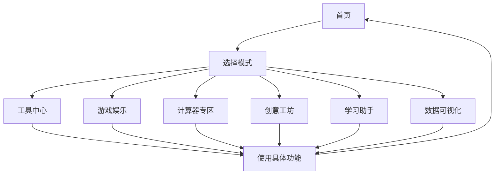

# 多功能超级平台 PRD

## 1. Product Overview
一个功能强大、设计精美的综合性平台，提供50+种模式和200+种实用功能。完美适配手机和电脑，为用户提供一站式解决方案。
- 目标：打造一个视觉震撼、功能完备、体验流畅的现代化网站
- 市场价值：满足各种日常使用需求，成为用户首选的多功能平台

## 2. Core Features

### 2.1 User Roles
| Role | Registration Method | Core Permissions |
|------|---------------------|------------------|
| 访客用户 | 无需注册 | 访问所有基础功能 |

### 2.2 Feature Module
1. **首页**: 欢迎区、模式分类导航、特色功能展示
2. **工具中心**: 50+种工具，200+功能集合
3. **游戏娱乐**: 各种小游戏和娱乐应用
4. **计算器专区**: 科学计算、金融计算、单位转换等
5. **创意工坊**: 设计工具、颜色工具、图片工具等
6. **学习助手**: 计时器、待办事项、笔记等
7. **数据可视化**: 各种图表和数据展示
8. **设置**: 主题切换、语言选择等

### 2.3 Page Details
| Page Name | Module Name | Feature description |
|-----------|-------------|---------------------|
| 首页 | Hero区域 | 动态背景、渐变文字、3D粒子效果 |
| 首页 | 模式导航 | 50+模式卡片网格布局 |
| 工具中心 | 工具网格 | 工具分类展示，点击展开功能 |
| 游戏娱乐 | 游戏区 | Canvas小游戏，流畅动画 |
| 计算器专区 | 计算器 | 多种计算器类型 |
| 创意工坊 | 设计工具 | 调色板、渐变生成等 |
| 学习助手 | 学习工具 | Pomodoro计时器、待办等 |
| 数据可视化 | 图表区 | ECharts图表展示 |

## 3. Core Process
用户访问网站 → 浏览首页模式导航 → 选择感兴趣的模式 → 进入功能页面 → 使用具体功能 → 完成操作或返回首页

## 4. User Interface Design

### 4.1 Design Style
- **主色调**: 深蓝色到青色渐变 (#0a0a0a → #00d2ff → #3a7bd5)
- **辅助色**: 紫粉色、橙色、绿色点缀
- **按钮风格**: 圆角矩形，带阴影和悬停动画，玻璃拟态效果
- **字体**: 现代无衬线字体 + 特殊展示字体
- **布局**: 网格卡片式布局，深度层叠效果
- **图标**: 现代线性图标 + 渐变背景
- **设计风格**: 赛博朋克/未来主义 + 玻璃拟态 + 3D元素

### 4.2 Page Design Overview
| Page Name | Module Name | UI Elements |
|-----------|-------------|-------------|
| 首页 | Hero区域 | 动态粒子背景、发光文字、悬浮动画、玻璃拟态卡片 |
| 首页 | 模式导航 | 渐变卡片、悬停上浮、图标放大、颜色变换 |
| 工具中心 | 工具网格 | 分类标签、筛选功能、卡片展开动画 |
| 游戏娱乐 | 游戏区 | Canvas渲染、游戏UI、得分显示 |
| 计算器专区 | 计算器 | 数字键盘、计算历史、主题切换 |
| 创意工坊 | 设计工具 | 颜色选择器、预览区、滑块控制 |
| 学习助手 | 学习工具 | 环形进度、任务卡片、时间显示 |
| 数据可视化 | 图表区 | 动态图表、数据控制面板 |

### 4.3 Responsiveness
- **Desktop-first**, 自适应到平板和手机
- 移动端优化的触控区域和手势
- 响应式网格，自动调整列数
- 适配各种屏幕尺寸

### 4.4 3D Scene Guidance (可选增强)
- 使用CSS 3D变换和perspective创建深度感
- Canvas粒子系统作为背景
- 元素入场动画使用Framer Motion风格
- 玻璃拟态卡片的模糊效果和透明度渐变

